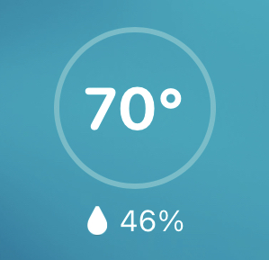

# symphony-homekit
Adds WaterFurnace Symphony temperature and humidity to HomeKit 

  
*Accessory as seen in Home app*

This virtual accessory is designed to show either the current room (air) temp and humidity readings, or the temperature and humidity setpoints, from Symphony enabled thermostats on WaterFurnace geothermal systems. 

It is not a thermostat accessory and is not interactive for several reasons, the primary being that geothermal systems are designed for and are most efficent when used to maintain a single setpoint rather than frequent adjustments.

## Requirements
* Python 3.5+ (Needs asyncio)
* Avahi/Bonjour (libavahi-compat-libdnssd-dev package on Debian/Ubuntu)
* A Symphony compatible thermostat with Aurora Web Link
* A [symphony.mywaterfurnace.com](https://symphony.mywaterfurnace.com) account
* HomeKit

## Getting Started
Tested on Ubuntu 18.04 and macOS 10.15 with Python 3.6 and Python 3.8. Should be compatible with \*nix based systems with Python 3.5+

1. Install requirements (virtual environment recommended)    
`python3 -m pip install -r requirements.txt`

#### Known Issue - Use patched pyhap version, pip version is incompatible [link](https://github.com/drakebrian/pyhap)

2. Set environment variables    
`$ export SYMPHONY_USER='johndoe@gmail.com'`    
`$ export SYMPHONY_PWD='password'`

3. Edit config.yaml 
 * name - Accessory name shown in HomeKit on pairing, can be changed in Home app
 * setpoint - True to show thermostat setpoints instead of actual readings
 * celsius - False to use Fahrenheit
 * port - Define port accessory runs on, default is 51826
 * polling_interval - Interval in seconds to poll Symphony websocket    
     * Must be less than 30 seconds or websocket will close. Symphony website polls every 5 seconds.    

4. Test accessory    
`python3 accessory.py`

5. Install as system service (optional)    
Full instructions coming, see [HAP-python repo](https://github.com/ikalchev/HAP-python) for examples.

## Credits
This project would not be possible without the HomeKit Automation Protocol project known as [HAP-python by ikalchev](https://github.com/ikalchev/HAP-python) and the [waterfurnace package by sdague](https://github.com/sdague/waterfurnace).

## To Do
* Evaluate additional parameters for more accessory options
* Verify python package version numbers